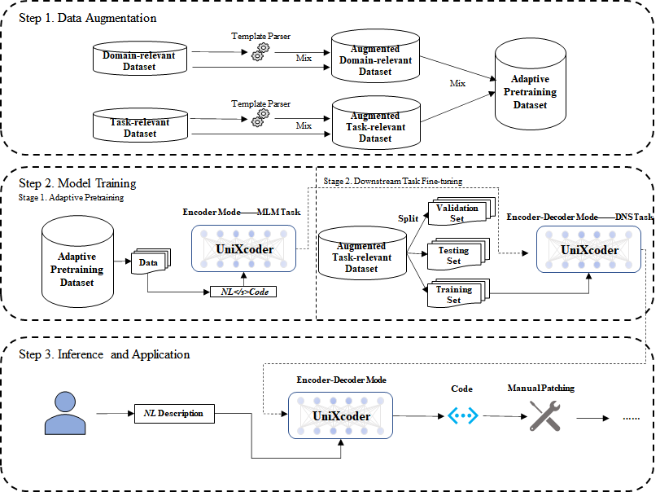

# UCGE
#### UniXcoder-based Code Generation for Expliot

#### UCGE can generate exploit code in Python/Assembly Language

<div>
    <center> The Framework of UCGE </center>
</div>

<div align='center'>

</div>


The overall layout of this program's file folder  is as below:

```

├── UCGE   
    ├── adaptive
            ├── model.py
            ├── run.py
            ├── utils.py
            ....
    ├── data
            ├── assembly
            ├── python
    ├── model
            ├── unixcoder-base
                    ├── config.json
                    ├── merges.txt
                    ├── pytorch_model.bin
                    ....
    ├── computer_metric.py                    
    ├── model.py
    ├── run.py
    ├── test.py 
    └──── utils.py
```


1. Download the UniXcoder model and configuration files from Huggingface, and remove them into the model folder.

   UniXcoder Link: [https://huggingface.co/microsoft/unixcoder-base/tree/main](https://huggingface.co/microsoft/unixcoder-base/tree/main)

   

2. If use the Adaptive Pretraining module, please switch to the **adaptive folder**, and edit your configuration in the **run.py** file.

   Then use the command `python run.py`, to begin the Adaptive Pretraining process.

   

3. Switch back to the **root directory**, and edit your configurations in the **run.py** file. If you use the adaptive pre-trained model, please don't forget to load the parameters.

   Then use the command `python run.py`, to begin the Downstream Task Fine-tuning Process.

